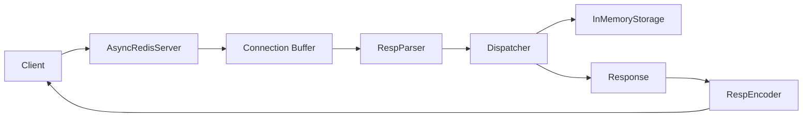

# Server Record

## 1. 문서 목적
- `src/server` 구현 범위와 책임을 기록한다.
- 서버 폴더 외에 추가된 모듈이 무엇이고 어떻게 연결되는지 정리한다.
- 이후 팀원이 `server`, `protocol`, `storage`, `main`을 함께 볼 때 빠르게 구조를 이해할 수 있도록 한다.

## 2. 서버 폴더 요구사항 정의서

### 2.1 담당 범위
- TCP 연결을 수락한다.
- 클라이언트별 요청 바이트를 수신한다.
- 수신 바이트를 RESP parser에 전달한다.
- parser가 반환한 `Command`를 dispatcher로 실행한다.
- dispatcher가 반환한 `Response`를 RESP encoder로 직렬화한다.
- 직렬화된 응답을 클라이언트에 송신한다.
- 잘못된 입력이나 예외가 발생해도 서버 전체 프로세스는 종료되지 않게 보호한다.

### 2.2 구현 기준
- 서버는 `asyncio` 기반 단일 이벤트 루프로 동작한다.
- 멀티스레드 명령 실행이 아니라 싱글 스레드 이벤트 루프 기반 동시 접속을 목표로 한다.
- 각 연결은 독립적인 입력 버퍼를 가진다.
- TCP는 스트림 기반이므로 요청이 분할되거나 여러 개가 붙어 올 수 있음을 전제로 한다.
- RESP 파싱은 완전한 명령이 도착했을 때만 dispatch 단계로 넘긴다.

### 2.3 현재 지원 명령
- `PING`
- `SET key value`
- `GET key`
- `DEL key`
- `EXISTS key`
- `EXPIRE key seconds`
- `TTL key`

## 3. 서버 폴더 내용

### 3.1 `src/server/tcp_server.py`
- `AsyncRedisServer` 클래스를 제공한다.
- `asyncio.start_server()`로 TCP 서버를 시작한다.
- `handle_client(reader, writer)`에서 클라이언트별 요청을 처리한다.
- 연결별 `buffer: bytes`를 유지하며 `read -> parse -> dispatch -> encode -> write` 루프를 수행한다.
- `ProtocolError` 발생 시 에러 응답을 보내고 해당 요청 버퍼를 비운다.
- 예외 발생 시 로그를 남기고 연결을 정리한다.

### 3.2 `src/server/dispatcher.py`
- `Dispatcher` 클래스를 제공한다.
- `StorageEngine` 구현체를 주입받아 명령을 실행한다.
- 명령 이름 분기, 인자 개수 검증, 정수 변환 검증을 담당한다.
- 프로토콜 형식은 알지 않고 `Command -> Response` 변환만 담당한다.

## 4. 서버 폴더 외 추가된 내용

### 4.1 Core
- `src/core/command.py`
  - 내부 명령 모델 `Command(name, args)` 추가
- `src/core/response.py`
  - 내부 응답 모델 `Response(kind, value, message)` 추가
  - `simple_string`, `bulk_string`, `integer`, `error` 생성 헬퍼 추가
- `src/core/exceptions.py`
  - `RedisError`
  - `ProtocolError`
  - `NeedMoreData`

### 4.2 Protocol
- `src/protocol/resp_parser.py`
  - RESP Array of Bulk Strings 요청 파서 구현
  - 입력: `bytes`
  - 출력: `tuple[Command, consumed_bytes]`
  - 데이터 부족 시 `NeedMoreData`
  - 잘못된 형식 시 `ProtocolError`
- `src/protocol/resp_encoder.py`
  - `Response`를 RESP 응답 바이트로 직렬화
  - 지원 응답 타입:
    - Simple String
    - Bulk String
    - Null Bulk String
    - Integer
    - Error

### 4.3 Storage
- `src/storage/engine.py`
  - 서버와 dispatcher가 의존하는 추상 저장소 인터페이스 추가
- `src/storage/in_memory.py`
  - 메모리 기반 key-value 저장소 구현
  - TTL과 lazy expiration 구현

### 4.4 Entry Point
- `src/main.py`
  - storage, parser, encoder, dispatcher, server를 조립하는 진입점 추가
  - `python -m src.main`으로 서버 실행 가능

### 4.5 Test and Config
- `tests/`
  - storage, dispatcher, parser, encoder, tcp server 테스트 추가
- `requirements.txt`
  - `pytest` 추가
- `pytest.ini`
  - 테스트 경로 고정
  - cache 수집 문제 방지 설정 추가

## 5. 아키텍처



### 5.1 계층 설명
- Transport Layer
  - `src/server/tcp_server.py`
  - TCP 연결 관리, 바이트 송수신, 연결 단위 에러 처리
- Protocol Layer
  - `src/protocol/resp_parser.py`
  - `src/protocol/resp_encoder.py`
  - RESP 바이트와 내부 객체 사이의 변환 담당
- Application Layer
  - `src/server/dispatcher.py`
  - 명령 실행 흐름과 비즈니스 분기 담당
- Data Layer
  - `src/storage/engine.py`
  - `src/storage/in_memory.py`
  - 실제 key-value 데이터와 TTL 관리
- Bootstrap Layer
  - `src/main.py`
  - 런타임 조립과 실행 담당

### 5.2 요청 처리 흐름
1. 클라이언트가 TCP로 접속한다.
2. `AsyncRedisServer.handle_client()`가 바이트를 읽는다.
3. 읽은 바이트를 연결별 `buffer`에 누적한다.
4. `RespParser.parse(buffer)`가 완전한 `Command` 하나를 파싱한다.
5. `Dispatcher.dispatch(command)`가 저장소 명령을 실행한다.
6. 실행 결과를 `Response`로 반환한다.
7. `RespEncoder.encode(response)`가 RESP 바이트로 변환한다.
8. 서버가 응답 바이트를 클라이언트에 전송한다.

## 6. 연동 방식

### 6.1 런타임 조립
`src/main.py`에서 아래 순서로 객체를 조립한다.

1. `InMemoryStorage()` 생성
2. `RespParser()` 생성
3. `RespEncoder()` 생성
4. `Dispatcher(storage)` 생성
5. `AsyncRedisServer(host, port, parser, encoder, dispatcher)` 생성
6. `asyncio.run(server.serve_forever())` 실행

### 6.2 의존 방향
- `tcp_server`는 parser, encoder, dispatcher에 의존한다.
- `dispatcher`는 `StorageEngine`에 의존한다.
- `in_memory`는 `StorageEngine`을 구현한다.
- parser와 encoder는 `core` 모델에 의존한다.
- `main`은 모든 구현체를 조립하지만 내부 동작에는 직접 개입하지 않는다.

## 7. API 명세서

### 7.1 내부 API: `AsyncRedisServer`

#### 생성자
```python
AsyncRedisServer(host: str, port: int, parser, encoder, dispatcher)
```

#### 메서드
```python
async def serve_forever() -> None
async def handle_client(reader: asyncio.StreamReader, writer: asyncio.StreamWriter) -> None
```

#### 역할
- 서버 시작
- 클라이언트 연결별 요청 처리
- parser/dispatcher/encoder 연계

### 7.2 내부 API: `Dispatcher`

#### 생성자
```python
Dispatcher(storage: StorageEngine)
```

#### 메서드
```python
def dispatch(command: Command) -> Response
```

#### 규칙
- 입력은 `Command`
- 출력은 `Response`
- RESP 형식 자체는 몰라야 함
- 저장소 구현체 교체 가능해야 함

### 7.3 내부 API: `RespParser`

```python
def parse(buffer: bytes) -> tuple[Command, int]
```

#### 반환값
- `Command`: 파싱된 명령
- `int`: 이번에 소비한 바이트 수

#### 예외
- `NeedMoreData`: 요청이 아직 덜 도착함
- `ProtocolError`: RESP 형식이 잘못됨

### 7.4 내부 API: `RespEncoder`

```python
def encode(response: Response) -> bytes
```

### 7.5 내부 API: `StorageEngine`

```python
def set(key: str, value: str) -> None
def get(key: str) -> str | None
def delete(key: str) -> int
def exists(key: str) -> int
def expire(key: str, seconds: int) -> int
def ttl(key: str) -> int
```

## 8. RESP 명령/응답 명세

### 8.1 요청 형식
- 현재는 RESP2의 `Array of Bulk Strings` 요청만 지원한다.

예시:

```text
*3\r\n
$3\r\nSET\r\n
$4\r\nname\r\n
$3\r\nkim\r\n
```

### 8.2 응답 형식
- `PING` -> `+PONG\r\n`
- `SET` 성공 -> `+OK\r\n`
- `GET` 성공 -> `$<len>\r\n<value>\r\n`
- `GET` miss -> `$-1\r\n`
- `DEL`, `EXISTS`, `EXPIRE`, `TTL` -> `:<number>\r\n`
- 에러 -> `-ERR <message>\r\n`

## 9. 실행 및 테스트

### 9.1 실행
프로젝트 루트에서 실행:

```bash
python -m src.main
```

기본 바인딩:
- host: `127.0.0.1`
- port: `6379`

### 9.2 테스트
프로젝트 루트에서 실행:

```bash
python -m pytest -q
```

## 10. 현재 한계
- persistence는 아직 `server` 흐름에 연결하지 않았다.
- cluster/router는 아직 연결하지 않았다.
- 요청 파서는 현재 RESP2의 기본 명령 형식만 지원한다.
- Postman이 직접 붙을 수 있는 HTTP 계층은 아직 없다.
- 운영용 graceful shutdown, 설정 파일, 고급 로깅은 아직 없다.

